> **Archived.** This is the original README of the upstream CareConnect reference
> implementation by Alireza Minagar, preserved unchanged below for attribution and for
> its screen-by-screen walkthrough (image paths adjusted for its new location). The
> current project README is at
> [`../README.md`](../README.md).

---

CareConnect


A responsive, accessible medical companion web application for care recipients (patients) living with short-term memory loss and their caregivers. Built React-first as an installable Progressive Web App with WCAG 2.1 Level AA accessibility engineered into every screen.

> Developed as a course artifact for **SWEN 661 — UI Implementation** (Assignment 10: Web Design & Early Implementation).

---

Table of contents
About
Who it's for
Key features
Accessibility
Tech stack
Project structure
Application flow
Getting started
Available scripts
Screens & walkthrough
Testing
Deployment
Roadmap
Authors
License
Acknowledgments
Disclaimer

---

About
CareConnect lowers the daily cognitive load for people who need help remembering, while giving caregivers clear visibility and control over medications and appointments. The patient experience is built around recognition over recall: a persistent orientation bar (who you are, the day and time, where you are), one primary task per screen, always-visible and timestamped medication status, and an undo path on every action. The caregiver experience is a denser dashboard for managing schedules and monitoring adherence.
The two experiences share a single accessible component library and design-token system, so behavior and styling stay consistent across the app.
Who it's for
Care recipients (patients) with short-term memory loss — calm, low-clutter screens, large targets, plain language, and no time pressure.
Caregivers — an information-rich dashboard with adherence tracking, alerts, and full schedule management.
Key features
Patient
Today home with a prominent "Next thing to do" card and the day's remaining items.
Medications with pill images, plain-language doses, always-visible status, and a 10-second undo on every dose.
Appointments in chronological order with full-word dates, locations, and "who is taking me."
A persistent "Call my caregiver" action on every patient screen.
Caregiver
Dashboard with adherence summary, an alerts region for missed/overdue items, and a recent-activity timeline.
Manage medications and manage appointments with accessible create/edit forms, inline validation, and delete confirmation.
All caregiver edits propagate to the patient screens.
Shared
Public landing page with an accessible, scoped AI assistant (explains the app and guides sign in/up; never gives medical advice).
Installable PWA with offline access to the day's schedule.
Accessibility
CareConnect is designed and verified against 21 WCAG 2.1 A/AA success criteria, with full conformance mapping in `ACCESSIBILITY.md`.
Highlights: 4.5:1 text contrast, full keyboard operability, visible focus indicators, semantic landmarks, ARIA live regions (`role="status"` / `role="alert"`), 44x44px minimum targets, 320px reflow with no horizontal scroll, and `prefers-reduced-motion` support.
Tech stack
Layer Technology
Framework React 18 + Vite
Language TypeScript (strict)
Styling Tailwind CSS with accessibility-first design tokens
Routing React Router (protected routes)
State / persistence React Context + `localStorage` (mock data)
AI assistant Anthropic API via a serverless/edge function
PWA Web App Manifest + Service Worker
Testing Jest + React Testing Library + Playwright (E2E)

---

Project structure

```
careconnect/
├── public/
│   ├── icons/                       # PWA maskable icons
│   ├── manifest.webmanifest         # PWA manifest
│   └── favicon.svg
├── docs/
│   └── screenshots/                 # README images (01-landing.png … 14-caregiver-activity.png)
├── scripts/
│   └── screenshots.ts               # Playwright screenshot automation
├── api/
│   └── assistant.ts                 # serverless function — Anthropic API proxy (key stays server-side)
├── src/
│   ├── components/                  # Accessible component library
│   │   ├── Button.tsx
│   │   ├── Card.tsx
│   │   ├── BigActionTile.tsx
│   │   ├── Field.tsx
│   │   ├── Banner.tsx
│   │   └── ConfirmDialog.tsx
│   ├── context/
│   │   ├── AuthContext.tsx          # mock auth, persisted to localStorage
│   │   └── RoleContext.tsx          # role + current patient profile
│   ├── shell/
│   │   ├── AppShell.tsx             # layout + semantic landmarks
│   │   ├── OrientationBar.tsx       # persistent date/time/greeting/"you are here"
│   │   ├── Navigation.tsx           # bottom nav (patient) / sidebar (caregiver)
│   │   └── ProtectedRoute.tsx       # redirects unauthenticated users
│   ├── pages/
│   │   ├── landing/
│   │   │   ├── LandingPage.tsx
│   │   │   ├── SignIn.tsx
│   │   │   ├── SignUp.tsx
│   │   │   └── Assistant.tsx        # accessible AI chatbot
│   │   ├── RoleChooser.tsx
│   │   ├── patient/
│   │   │   ├── Today.tsx
│   │   │   ├── Medications.tsx
│   │   │   └── Appointments.tsx
│   │   └── caregiver/
│   │       ├── Dashboard.tsx
│   │       ├── ManageMedications.tsx
│   │       ├── ManageAppointments.tsx
│   │       └── Activity.tsx
│   ├── data/
│   │   └── mockData.ts              # seed medications & appointments
│   ├── lib/
│   │   └── storage.ts               # localStorage helpers
│   ├── styles/
│   │   └── tokens.css               # design tokens + global focus styles
│   ├── App.tsx                      # route definitions
│   ├── main.tsx                     # app entry
│   └── serviceWorker.ts             # PWA offline caching
├── .env                             # local secrets (gitignored — never commit)
├── .env.example                     # placeholder environment variables
├── .gitignore
├── ACCESSIBILITY.md                 # WCAG 2.1 AA conformance mapping
├── LICENSE                          # MIT
├── README.md
├── index.html
├── package.json
├── tailwind.config.js
├── tsconfig.json
└── vite.config.ts
```

> The tree above reflects the intended architecture. To regenerate the exact tree from your machine, run `tree -I "node_modules|dist" -L 3` (install `tree` if needed) or copy the structure from the VS Code Explorer.
> Application flow

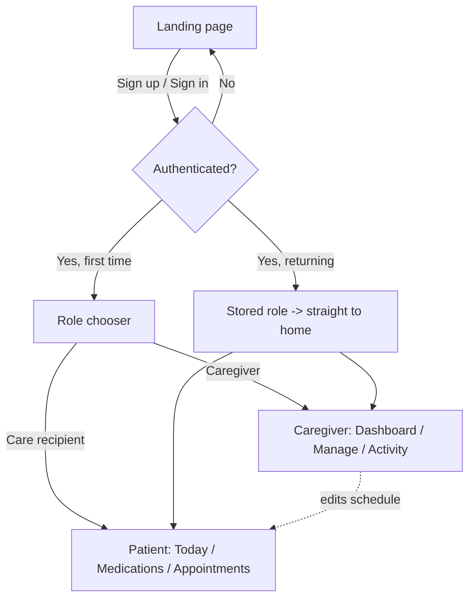

---

Getting started
Prerequisites
Node.js 18+ and npm
A modern browser
(Optional) An Anthropic API key for the landing-page assistant
Get the code
Clone with Git (HTTPS):

```bash
git clone https://github.com/aliminagar/careconnect-swen661.git
cd careconnect-swen661
```

Clone with SSH:

```bash
git clone git@github.com:aliminagar/careconnect-swen661.git
cd careconnect-swen661
```

Clone with GitHub CLI:

```bash
gh repo clone aliminagar/careconnect-swen661
cd careconnect-swen661
```

Download without Git: on the GitHub repo page, click Code → Download ZIP, then unzip and open the folder.
Install and configure

```bash
npm install
cp .env.example .env     # then fill in your values
```

`.env` variables:

```
VITE_SUPABASE_URL=your_supabase_url            # only if using Supabase
VITE_SUPABASE_ANON_KEY=your_supabase_anon_key  # public/anon key (protected by RLS)
# Server-side only — NEVER prefix with VITE_:
ANTHROPIC_API_KEY=your_anthropic_key           # used by api/assistant.ts
```

> The app runs on mock `localStorage` data without any backend keys. If the Anthropic key is absent, the assistant falls back to a scripted guided helper.
> Run

```bash
npm run dev      # http://localhost:5173
```

Publish your own copy to GitHub
If the project isn't on GitHub yet:

```bash
git init
git add .
git commit -m "Initial commit: CareConnect"
git branch -M main
git remote add origin https://github.com/aliminagar/careconnect-swen661.git
git push -u origin main
```

> Confirm `.env` is listed in `.gitignore` before your first push so secrets never reach the repo.

---

Available scripts
Script Description
`npm run dev` Start the Vite dev server
`npm run build` Production build to `/dist`
`npm run preview` Preview the production build locally
`npm test` Run Jest + React Testing Library unit/component tests
`npm run screenshots` Generate README screenshots via Playwright

---

Screens & walkthrough

> **Capturing screenshots:** run `npm run dev`, then `npm run screenshots` (Playwright), or capture manually with your OS tool. Images live in `docs/screenshots/` and are embedded below.

### 1. Landing page

Public entry: hero, "How it helps" cards, privacy reassurance, Sign up / Sign in CTAs.

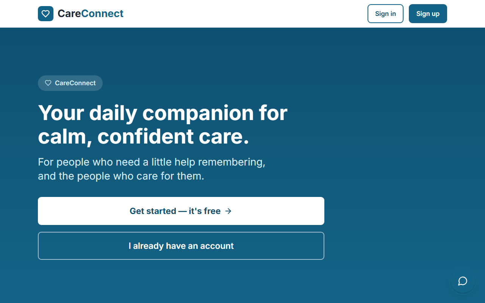

### 2. AI assistant

Accessible chatbot panel (aria-live, focus management) scoped to onboarding — no medical advice.

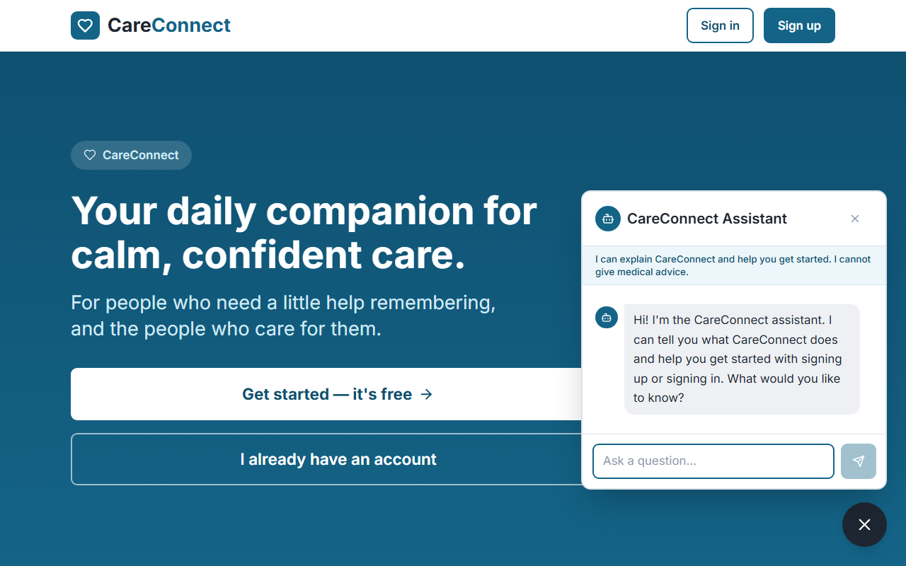

### 3. Sign up

Accessible registration form with visible labels and inline validation.

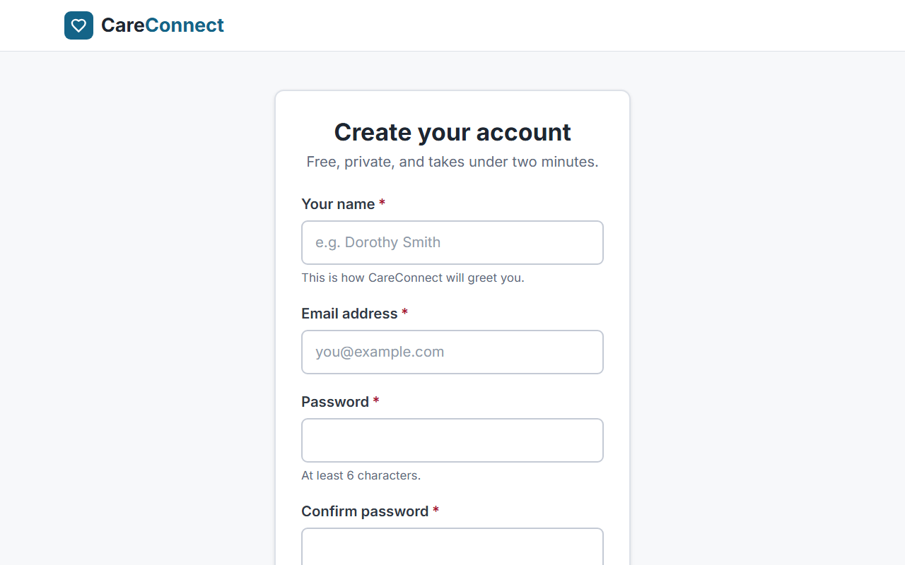

### 4. Sign in

Mock auth with the same accessible form pattern.

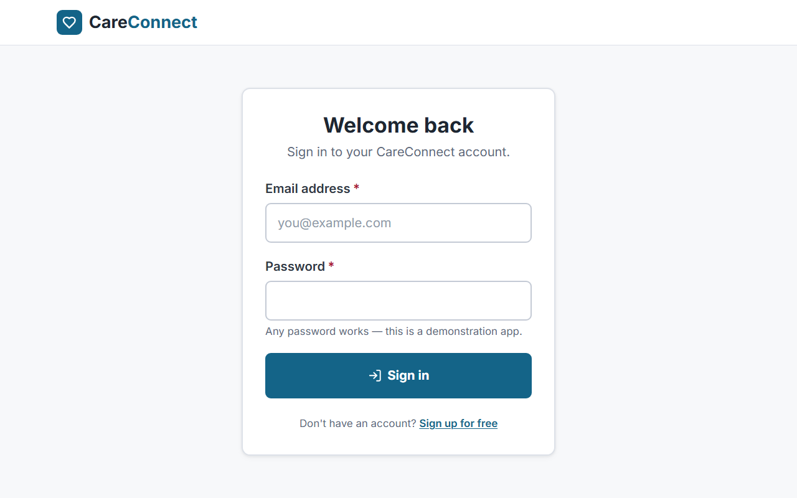

### 5. Role chooser

Post sign-in choice between Care Recipient and Caregiver; persists for future logins.

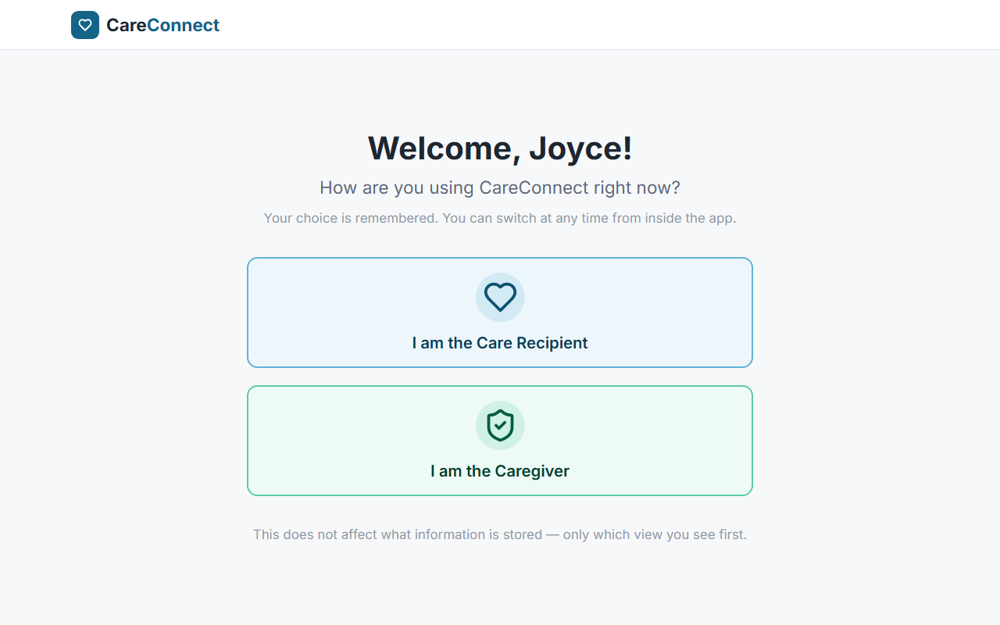

### 6. Patient — Today

Calm home with "Next thing to do" and the day's remaining items.

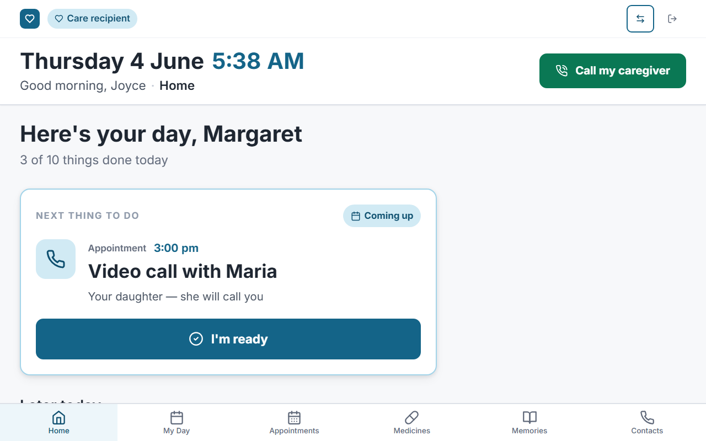

### 7. Patient — Medications

Pill images, plain-language doses, always-visible status.

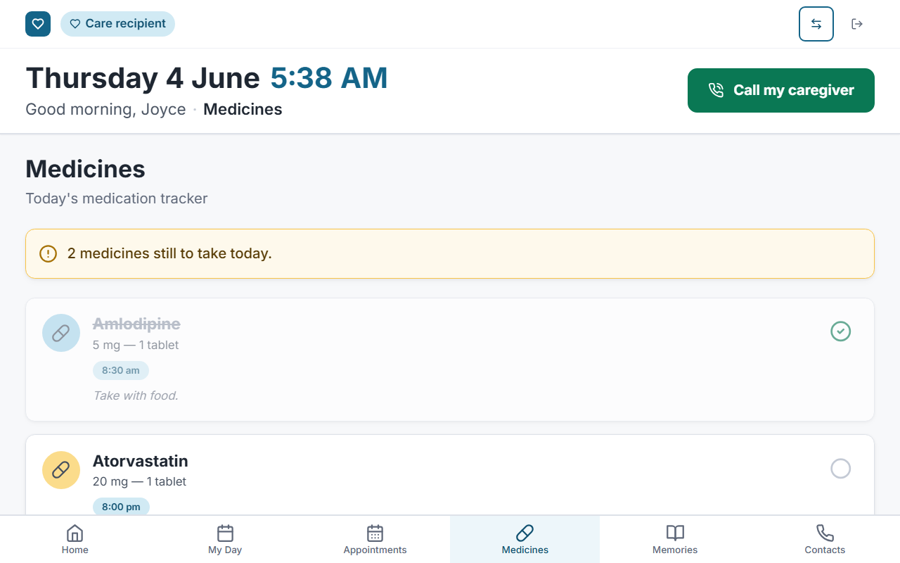

### 8. Medication taken

Polite confirmation plus a 10-second undo.

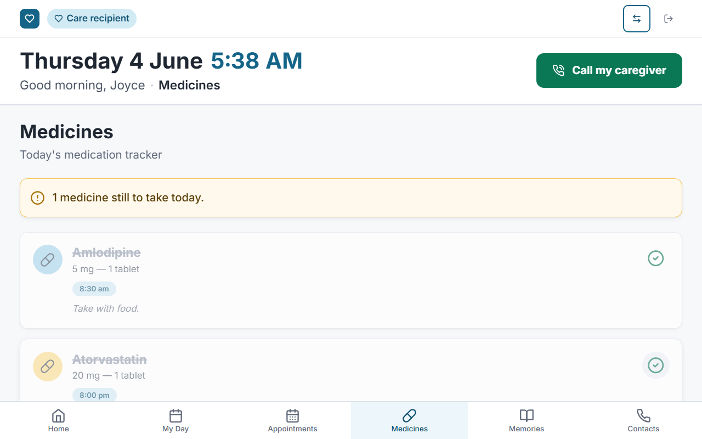

### 9. Patient — Appointments

Chronological appointments with full-word dates and directions.

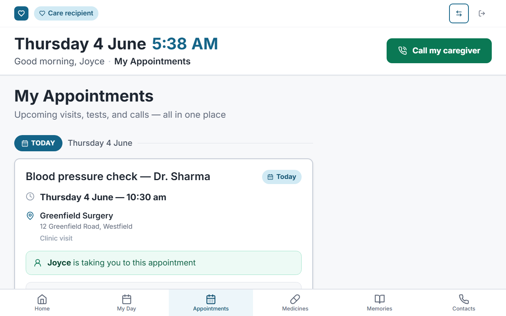

### 10. Caregiver — Dashboard

Adherence summary, alerts region, recent activity.

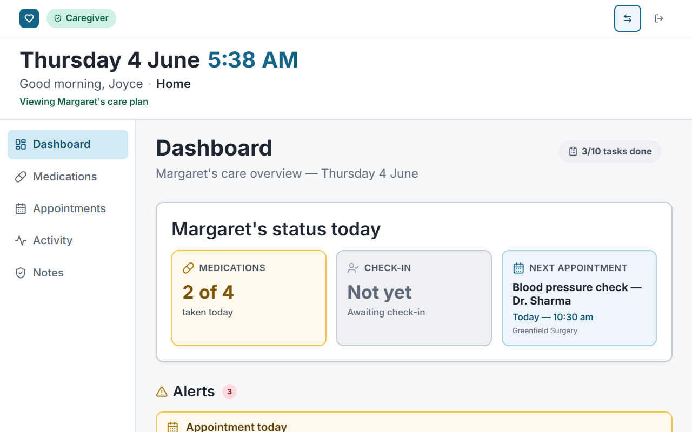

### 11. Caregiver — Manage medications

Medication list with edit and confirm-on-delete.

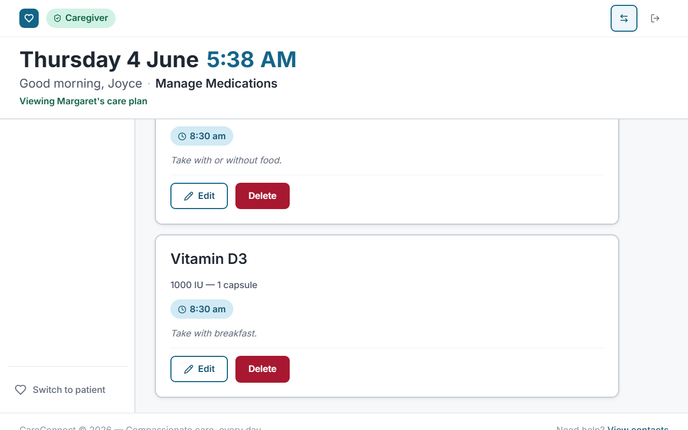

### 12. Caregiver — Medication form

Accessible add/edit form with full validation.

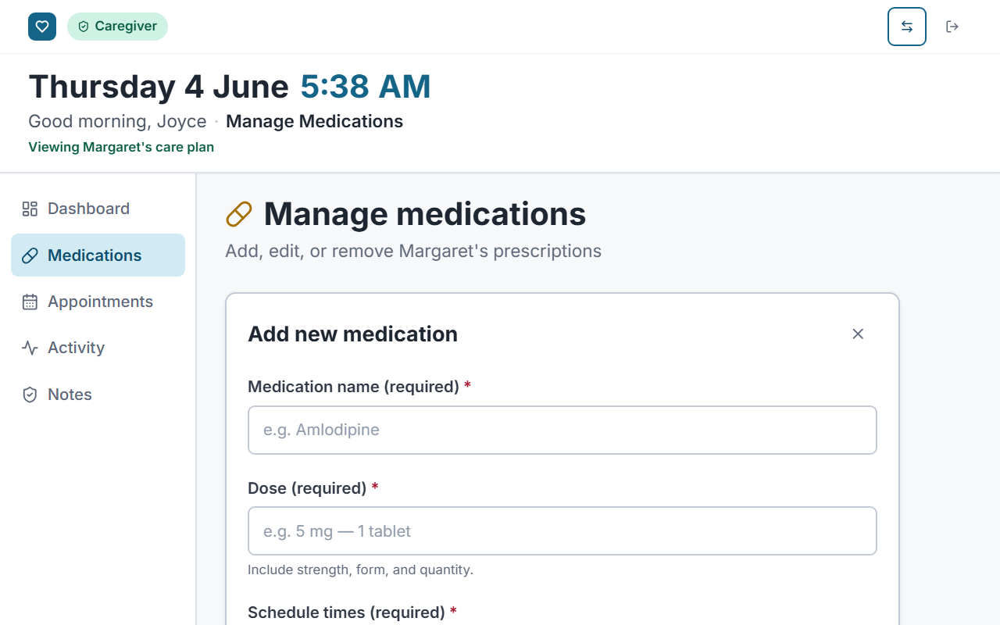

### 13. Caregiver — Appointments

Appointment list and accessible add/edit form.

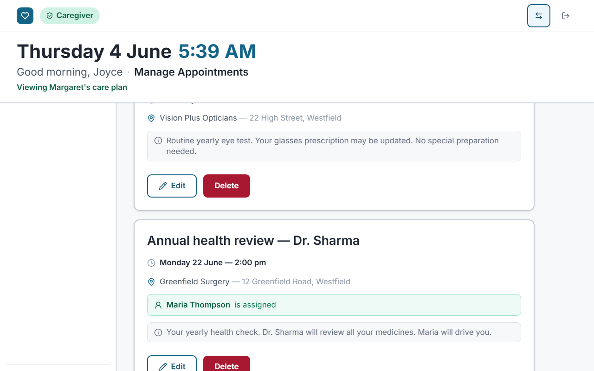

### 14. Caregiver — Activity

Timestamped log of taken/skipped doses and check-ins.

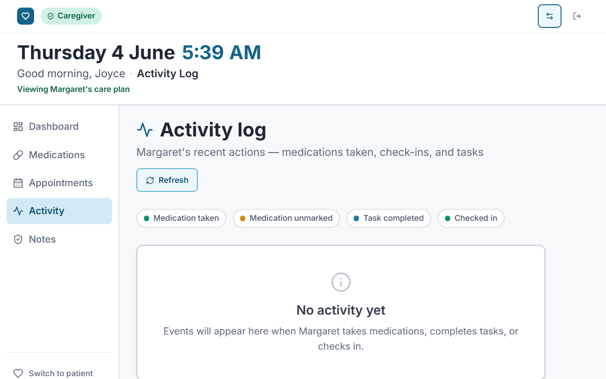

---

Testing
Unit & component: Jest + React Testing Library (`npm test`), targeting 60–75% coverage per the course milestones.
End-to-end: Playwright specs for core flows (sign in → take medication → caregiver sees adherence).
Accessibility: axe DevTools, Lighthouse (target 95+ accessibility), and manual screen-reader testing (NVDA / VoiceOver) plus keyboard-only navigation.
Deployment

```bash
npm run build       # outputs to /dist
```

Deploy `/dist` to Netlify or Vercel. Configure the assistant's serverless function and set `ANTHROPIC_API_KEY` in the host's environment settings (never client-side).
Roadmap
Real backend with Supabase + Row Level Security
Multi-patient support for caregivers
Push-notification medication reminders
Localization / bilingual support

---

Authors
Alireza Minagar — Author & Developer
AI/ML Software Engineer · Founder & CTO, Perfect Strokes LLC · Adjunct Professor, UMGC.
Physician-scientist turned software engineer, with graduate work in Bioinformatics, Software Engineering, and Cybersecurity, focused on the intersection of healthcare and applied AI/ML.
GitHub: `https://github.com/aliminagar`
LinkedIn: `https://www.linkedin.com/in/alireza-minagar-ai`
Website: `https://alirezaminagar-md.netlify.app/`
Additional contributors (SWEN 661 team), if applicable:
`Name` — role
`Name` — role

> Replace the placeholder links and add team members as needed.
> License
> Distributed under the MIT License. See `LICENSE` for full text.

```
Copyright (c) 2026 Alireza Minagar / Perfect Strokes LLC
```

> MIT is permissive and ideal for a portfolio/course project. If you prefer an explicit patent grant use **Apache-2.0**; if you want copyleft (derivatives must stay open) use **GPL-3.0**. Tell me and I'll swap the LICENSE file.
> Acknowledgments
> University of Maryland Global Campus — SWEN 661 (UI Implementation)
> The WCAG 2.1 guidelines and the WAI-ARIA Authoring Practices
> Initial scaffolding accelerated with Bolt.new; completed and hardened locally
> Disclaimer
> CareConnect is an educational prototype built as a course artifact. It is not a medical device, provides no medical, dosage, or clinical advice, and must not be used for real patient care or to manage actual medications. It uses mock data only and is not intended to store real protected health information (PHI). For any real health decision, consult a licensed clinician.
